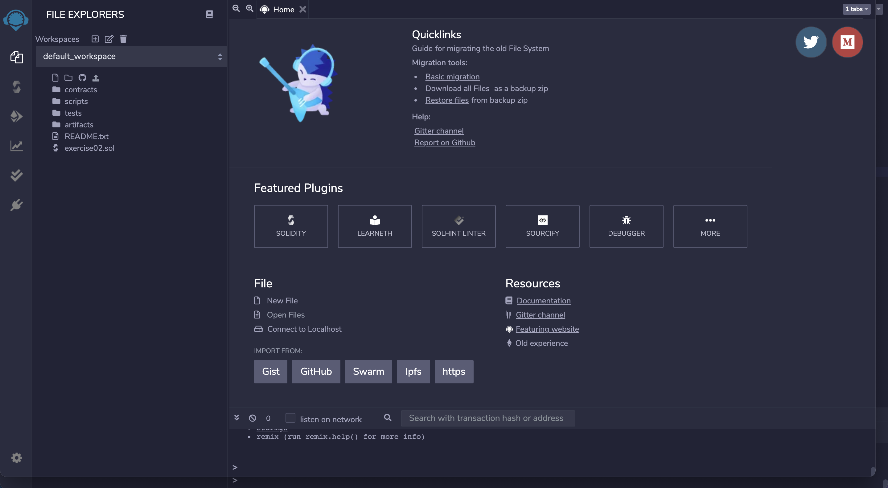

# Blockchain

### 코드 개발방법
1. [Remix Online](https://remix.ethereum.org/)  

2. File-New File 클릭하여 새로운 파일 생성
3. 파일 이름 지정
4. 코드 작성

### Excercise
1. exercise01: 점수를 입력하면 학점을 출력하는 조건문 함수
2. exercise02: 학생 명단
3. exercise03: 자동으로 계산하는 함수
