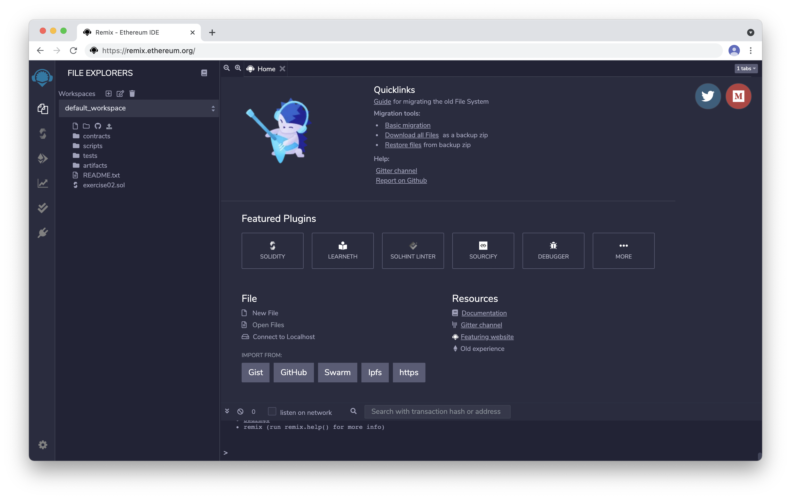

# Blockchain

### 코드 개발방법
1. [Remix Online](https://remix.ethereum.org/)  

2. File-New File 클릭하여 새로운 파일 생성
3. 파일 이름 지정
4. 코드 작성


### Contract
1. 버전 선언 (단, 선언한 버전과 deploy된 버전이 같은지 확인 필요)
``` solidity
pragma solidity ^0.7.6;
```
2. 계약 선언
``` solidity
contract Count {}
```
3. 변수 선언
``` solidity
변수타입 public 변수명;
```
4. 결과 출력 함수 선언 (version 5 이상 constant 제어자 사용불가, view 사용 권고)
``` solidity
function 함수명() public view returns(변수타입){
        return 변수명;
    }
```
5. 실행 함수 선언
``` solidity
function 함수명() public {
        실행코드
    }
```


### Excercise
1. exercise01: 점수를 입력하면 학점을 출력하는 조건문 함수
2. exercise02: 학생의 학번, 이름, 학과를 입력해놓은 함수
3. exercise03: 숫자가 자동으로 증감하는 계약 함수
4. exercise04: 예금 및 인출 후 잔고 변화 확인 함수  
 4-1. 예금 함수 (`payable`: 돈을 주고 받을 때, 선언하는 함수)  
 4-2. 인출 함수 (ifelse 예금할 금액 ≥ 인출할 금액, 인출, 잔고 변화없음)  
 4-3. 계좌 주인과 계약 주인이 같은지 확인하는 함수 (`address`: 계좌 주소 변수 타입)  
 4-4. 잔고 출력 함수  
5. exercise05: 토큰의 주소로 잔고를 확인할 수 있는 함수
 5-1. mapping: key와 value를 연결하기 위한 함수
 5-2. event, emit: 로그 기록을 남기는 함수
 5-3. supply: 계약을 최초로 생성할 때, 공급량을 설정하는 함수
